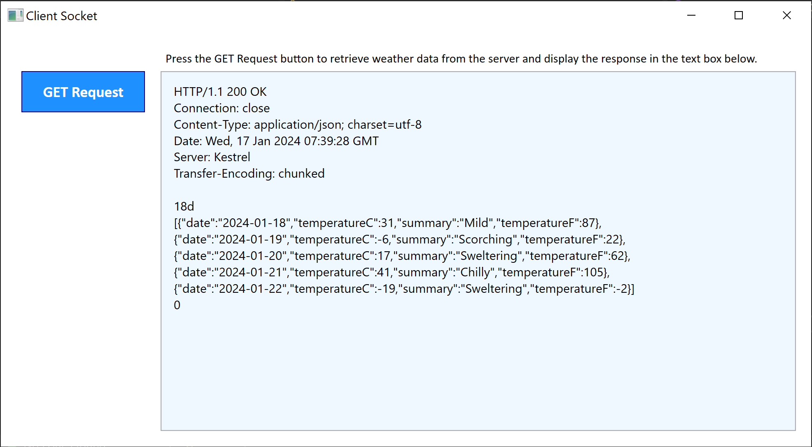

# Network Programming in .NET

This repository presents a sample implementation of the Socket class in .NET. 

The repository contains a client application and a server application. The server application provides weather forecast data via an API, the client requests data via the API endpoint using the async methods of the Socket class and displays the response in a text box. 

In the event of an exception, the corresponding exception message is displayed in the text box.

## Objectives
- Create an API endpoint
- Establish a client-server socket connection
- Send requests to the API endpoint
- Parse and display responses using a Windows Presentation Form (WPF) application
- Use the TcpClient and TcpListener helper classes to work with Transfer Control Protocol (TCP)